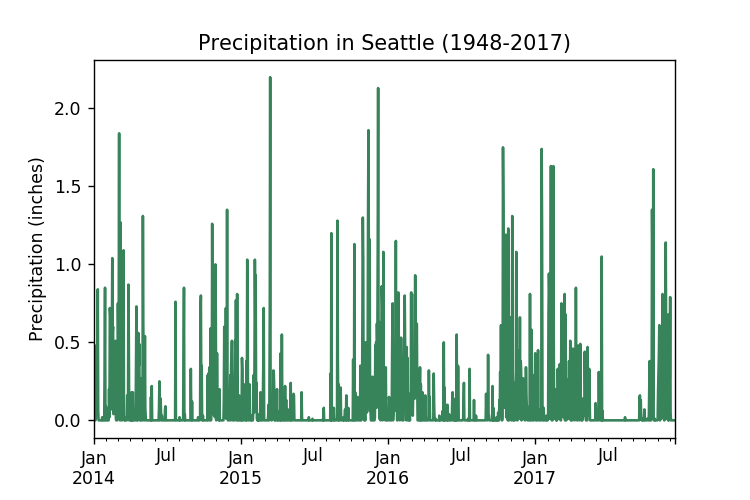
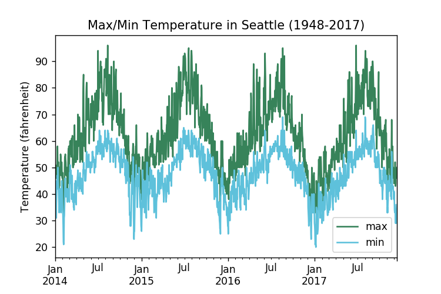
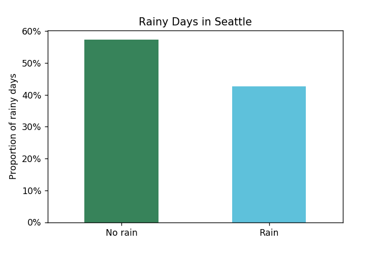
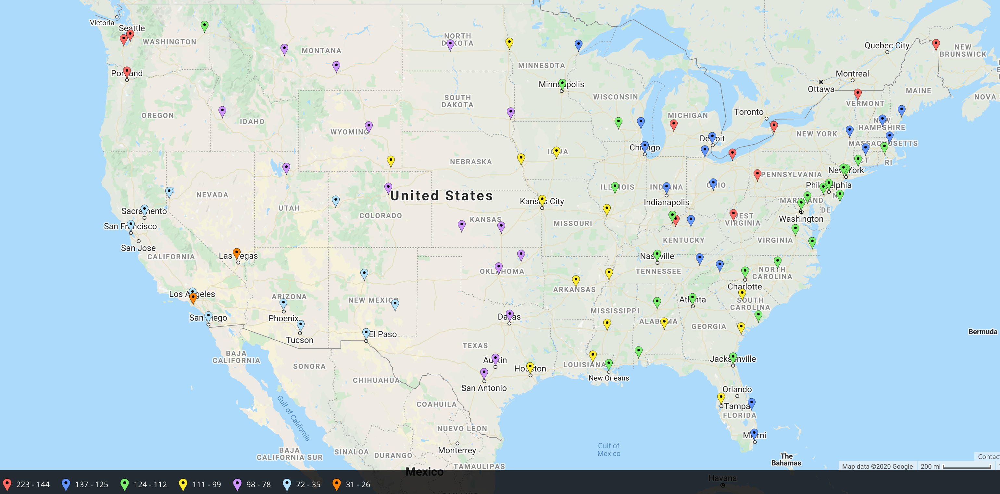
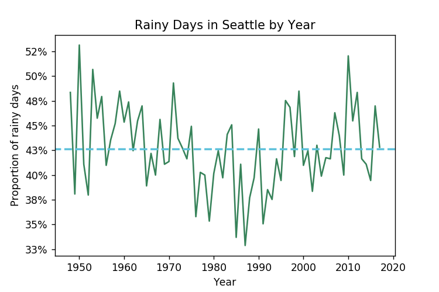
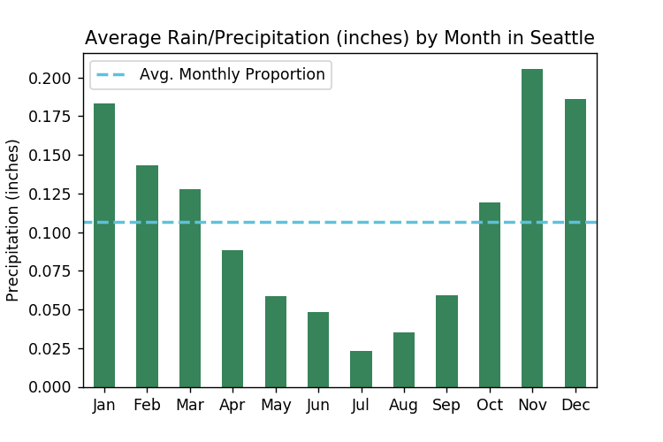
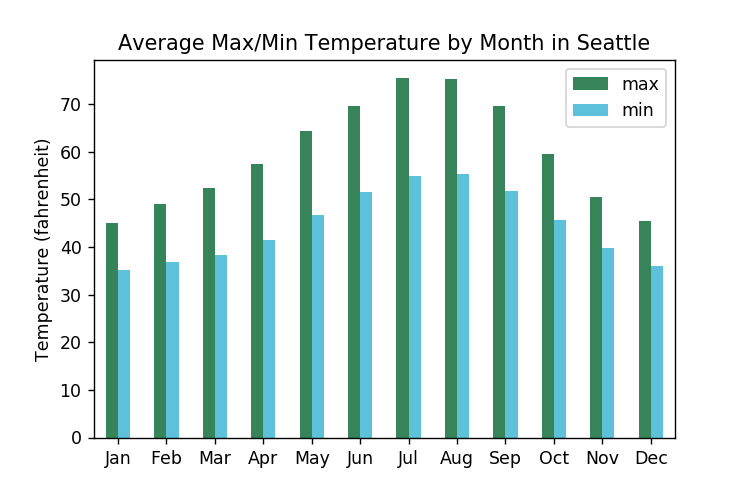
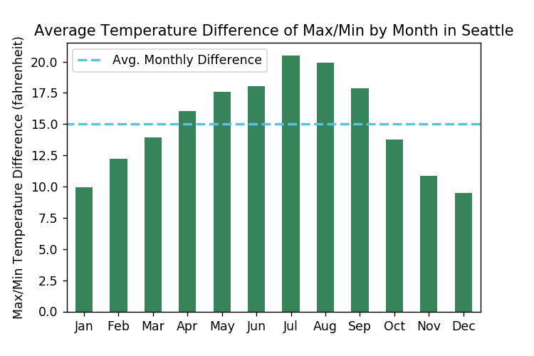

When people speak about places to live and visit, a few things come to mind almost immediately: culture, food, and __weather__. Seattle might as well be a synonym for rain. While I was looking to relocate to Seattle, my friends almost universally responded "it rains a lot there." I have spent several years and Chicago. Chicago has its grey, rainy days, so I was not deterred by these comments. While I won't be comparing Chicago to Seattle, this post will generally explore the rain patterns of Seattle to find out if the anecdotes are true.

Three questions come to mind as it pertains to weather in Seattle:

- What frequency does it rain?
- How much actual rainfall occurs (measured in precipitation/inches)?
- Are there seasonal trends of rain?

While I won't include national data in this exploration, I will try to compare Seattle results to national averages.

The [data](https://www.kaggle.com/rtatman/did-it-rain-in-seattle-19482017) we will use for this analysis is a time series from 1948-2017 with the following:

- `date`: date associated with weather metrics
- `prcp`: precipitation in inches
- `tmax`: max temperature (Fahrenheit)
- `tmin`: minimum temperature (Fahrenheit)
- `rain`: whether it rained or not

All the code used for this analysis can be found at [here](https://github.com/GoldbergData/seattle-rain/blob/master/seattle_rain.ipynb).

Missing values do not look significant since only three dates of data are missing in the `prcp` and `rain` column. We will leave these missing values alone for now until they pose a problem.

<table border="0" class="dataframe">
  <thead>
    <tr style="text-align: right;">
      <th></th>
      <th>date</th>
      <th>prcp</th>
      <th>tmax</th>
      <th>tmin</th>
      <th>rain</th>
    </tr>
  </thead>
  <tbody>
    <tr>
      <th>18415</th>
      <td>1998-06-02</td>
      <td>NaN</td>
      <td>72</td>
      <td>52</td>
      <td>NaN</td>
    </tr>
    <tr>
      <th>18416</th>
      <td>1998-06-03</td>
      <td>NaN</td>
      <td>66</td>
      <td>51</td>
      <td>NaN</td>
    </tr>
    <tr>
      <th>21067</th>
      <td>2005-09-05</td>
      <td>NaN</td>
      <td>70</td>
      <td>52</td>
      <td>NaN</td>
    </tr>
  </tbody>
</table>

Here are general time series plots of the numeric data (precipitation and temperature). It's hard to glean any insights from this high-level view, but it's good to take a quick glance in case anything jumps out.

## What frequency does it rain in Seattle?

It rained ~43% of the time in Seattle from 1948-2017. On average, that's approximately ~157 days per year.

To understand if the number of rainy days in Seattle is anomalous, let's compare to the rest of the U.S.

Washington is red, indicating that the state experiences rain 144-223 days over the course of the year. Our analysis shows ~153 days of rain each year from 1948-2017. There are a few other states/areas spread about the northeast that experience similar levels to Seattle in terms of rain. Most of the states center in in between 78-137 days of rain each year.

### Frequency by year
The previous plot summarizes the the entire data set. Did the proportion of rainy days vary across time? Let's check this out over the years elapsed in the time series.

At first glance, the data looks [mean-reverting](https://mathworld.wolfram.com/ReversiontotheMean.html). There is a strong decline starting in the mid 1970s that oscillates until the 1990s, but this is probably more stochastic than any kind of trend.

### Frequency by month

Before we look at frequency of rainy days by month, what would we expect? I have spent a lot of time in Florida and we always expect rain during the summer leading to the fall (hurricane season). Does Seattle fair the same for when rain is expected based on my experience?

Interestingly, rainy days in the summer is not the case in Seattle. It looks like the least amount of rain days happens during the summer and fall! With the peak amount of rain days occurring during the winter and spring. Something to look further into would be the amount of rain/precipitation. It's possible that there are not as many rainy days in the summer, but when it rains Seattle may experience more rain measured by precipitation in inches.

## How much actual rainfall occurs (measured in precipitation/inches) in Seattle?

We observed previous that rainy days (categorized as any amount of rain occurring in a day), is least likely during the summer months in Seattle. In this section, we will look further to explore the trends in actual rainfall across year and month.

We see a similar U-shape in mean precipitation compared to the proportion of days rained plot. In other words, more actual rain fall occurs in spring and winter with the least amount of rainfall occurring in the summer. Let's see if temperature provides any explanatory power to precipitation.

Higher temperatures in the summer (obviously) coincide with less rain. This is not too interesting, given its temperature trend is obvious. However, we can look to see if the range between high/low temperature provides more information.

Winter in Seattle experiences the most stable period of temperatures, while summer has a wide gap between high/low temperatures.

## Are there seasonal trends of rain in Seattle?

We have actually answered this question with the previous visualizations. Rain is persistent in the spring and winter months, while the summer appears to experience the least amount of rain. A quick [web search](https://cliffmass.blogspot.com/2015/02/why-is-northwest-warm-and-california.html) reveals that Seattle summers are warm and dry for specific meteorological reasons.

## What can we conclude?

Generally speaking, Seattle experiences a high number of 'rainy' days compared to the rest of the country. However, if we look at actual rainfall, [Seattle ranks](http://www.usa.com/rank/us--average-precipitation--state-rank.htm) in the middle of the pack.

Additionally, it's useful to know that the summers are dry and warm (rather than extremely hot). Seattle summers are [rumored](https://www.thrillist.com/entertainment/seattle/17-reasons-seattle-summers-dominate-all-other-summers) to be a blast — probably driven by the mild summer weather. Lastly, Seattle winters look predictable (temperature wise) as the high/low temperature range is narrow. So while you may see many more days of rain in the winter, you can expect to wear similar layers to fend off any chilly air.
